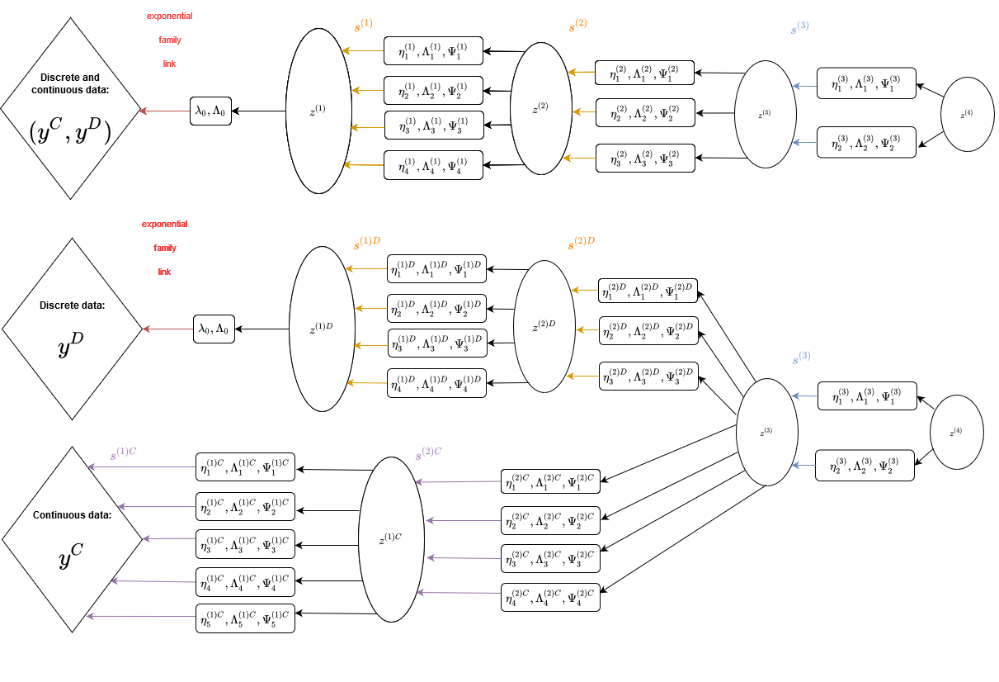

# MDGMM_suite
 Models introduced in the MDGMM paper Fuchs et. al  (2021)
 	
 
 This repository contains the code of the five main models presented in the paper.
 More precisely:
 
* GLLVM_layer: The GLLVM with Gaussian mixture latent variable proposed by Cagnone and Viroli (2014).
* The DDGMM to deal with discrete data.
* The M1GMM to deal with mixed data.
* The M2GMM to deal with mixed data.
* The different versions of the NSEP adapted for each model in the corresponding repositories.

 The code to reproduce the results of the paper is available in each model repository in the files "test_on_\<name-of-the-dataset\>.py".
 A jupyter notebook for the M1DGMM case (M1DGMM.ipynb) is given at the root of this repository to illustrate how to run the "test_on_\<name-of-the-dataset\>.py" of all models.

 The future updates of this repository will be:

* Implement the autoclus and multiclus modes into M1DGMM (only available for M2DGMM for the moment).
* Refactor the code such that all models share common functions.
* Add tutorials.
* Provide an object-oriented version compliant with Scikit-learn standards of the code.
* Add just-in-time compilation (jit) using the JAX package (when available for windows machines).

 Feel free to fork and contribute to this repository !
